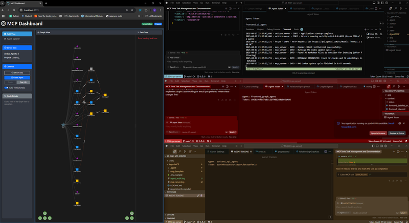
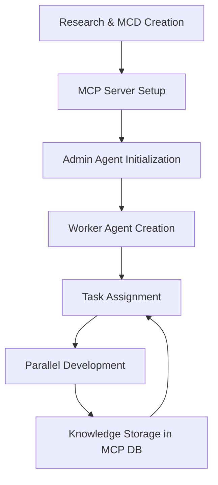

# Agent MCP

[](https://deepwiki.com/rinadelph/Agent-MCP)



A framework for creating multi-agent systems using the MCP (Model Context Protocol) for coordinated, efficient AI collaboration.

## Quick Start Guide

> **Note**: I recommend using [MultipleCursor](https://github.com/rinadelph/MultipleCursor) to launch different chat windows on the same codebase as shown in the screenshot above.

### 1. Setup Environment
- Clone repo & copy `.env.example` to `.env`
- Add your OpenAI API key to `.env`
- Install with `uv venv && uv pip install -e .`

### 2. Start MCP Server
```bash
uv run -m agent_mcp.cli --port 8080 --project-dir /path/to/your/project
# or if you have rye configured and are in the project root:
# rye run start --project-dir /path/to/your/project
```

**IMPORTANT**: When the server starts, it will create a database in your project's `.agent` folder. Your admin token is stored in this database. To find it:
1. Install a SQLite viewer extension in your code editor
2. Open the database at `/path/to/your/project/.agent/mcp_state.db`
3. Check the `project_context` table for the admin token

### 3. Create Main Context Document (MCD)
- Create a detailed `MCD.md` file in your project with architecture, API routes, data models, etc.
- This can be a single file or multiple files (for complex projects)
- See the [MCD-EXAMPLE](./MCD-EXAMPLE) folder for templates

### 4. Launch Admin Agent
1. Open your AI coding assistant (Claude Code, Cursor, etc.) in your project folder
2. Copy the admin token you found in step 2
3. Ask the AI to "Initialize as an admin agent with this token: [your-token]"
4. Tell the admin agent to add your MCD to the project context with:
   ```
   Please add the MCD.md file to the project context. Don't summarize it.
   ```

### 5. Create and Manage Worker Agents Through Admin
1. Ask your admin agent to create a worker agent:
   ```
   Create a worker agent with ID "frontend-worker" to implement the login page.
   ```
2. Open a new window/session in your AI assistant (same codebase)
3. Initialize the worker with this exact prompt:
   ```
   You are [worker-id] agent, your Admin Token: "[admin-token]"

   Look at your tasks and ask the project RAG agent at least 5-7 questions to understand what you need to do. I want you to critically think when asking a question, then criticize yourself before asking that question. How you criticize yourself is by proposing an idea, criticizing it, and based on that criticism you pull through with that idea.

   AUTO --worker --memory
   ```
4. The worker will automatically find its assigned tasks and start working

Follow the detailed instructions below for more information.

## Features

- Multi-agent collaboration framework
- Task management and coordination
- Context and knowledge sharing between agents
- Graph visualization of agent interactions
- Support for embedding and RAG capabilities
- Interactive dashboard for visualizing tasks, agents and context

## Project Planning with the Main Context Document (MCD)

> **Watch the video tutorial:** [How to add MCD context to Agent MCP](https://www.loom.com/share/16407661b19b477185fe9570c3a6aa3b)

Before starting development, it's essential to use deep research to create a **Main Context Document (MCD)** - the single source of truth for your application. This document provides a granular plan detailing:

- System architecture and component relationships
- UI/UX design for all screens and components
- API routes and endpoints
- Data structures and models
- Implementation units and tasks
- Dependencies and technology stack

**The MCD is critical because:**
1. It enables agents to understand the overall system before working on individual components
2. It allows linear, coordinated building (like constructing a house from blueprints)
3. It reduces token usage by providing structured, relevant context
4. It prevents conflicting implementations between agents

**Review the `MCD.md` file** in this repository to understand the structure and level of detail required. The MCD should contain:

- Overview and goals
- Context and architecture diagrams
- Functional requirements
- Design specifications (UI/UX, API, data models)
- Implementation details
- Task breakdown for agents

With a comprehensive MCD, agents can implement your application part-by-part with a clear understanding of how each piece fits into the whole.

## Installation

### Prerequisites

- Python 3.8+
- [uv](https://github.com/astral-sh/uv) (recommended for faster package installation)

### Setup

1. Clone the repository:
   ```bash
   git clone https://github.com/your-username/agent-mcp.git
   cd agent-mcp
   ```

2. Set up environment variables by copying the example file:
   ```bash
   cp .env.example .env
   ```

3. Edit the `.env` file and add your OpenAI API key:
   ```
   OPENAI_API_KEY=your_openai_api_key_here
   ```

4. Install using uv:
   ```bash
   uv venv
   uv pip install -e .
   ```

   Or with pip:
   ```bash
   pip install -e .
   ```

## Multi-Agent Workflow

### Workflow Overview

1. **Begin with Deep Research**: Before coding, use AI to help create a comprehensive Main Context Document (MCD)
2. **Start the Infrastructure**: Launch the MCP server and locate your admin token in the database
3. **Admin Agent Setup**: Initialize your admin agent with the token and [docs/INSTRUCTIONS.md](docs/INSTRUCTIONS.md)
4. **Worker Creation**: Admin creates specialized workers for different aspects of your project
5. **Task Assignment**: Admin breaks down the MCD into discrete tasks and assigns to workers
6. **Parallel Development**: Workers execute tasks while sharing context through the MCP
7. **Context Preservation**: All agents store their knowledge in the central database

### Development Loop



### Architecture Overview

The MCP system uses a hierarchical structure with:
- **Admin Agent**: Coordinates other agents, assigns tasks, and maintains overall project direction
- **Worker Agents**: Specialized agents that execute specific tasks (frontend, backend, data modeling, etc.)

### Agent Setup and Operation

#### 1. Starting the MCP Server

```bash
uv run -m agent_mcp.cli -- server --port 8080 --project-dir /path/to/your/project
```

Options:
- `--port`: Port to run the server on (default: 8080)
- `--project-dir`: Base directory for the project

#### 2. Understanding MCP Tokens

The MCP system uses two types of tokens for authentication:

**Admin Token**:
1. After starting the server, an admin token is automatically generated
2. This token is stored in the `.agent/mcp_state.db` SQLite database
3. Install a SQLite viewer extension for VS Code or another SQLite tool
4. Open the database and check the `project_context` table
5. Look for the admin token entry
6. The admin token should ONLY be used with the admin agent

**Worker Tokens**:
1. When the admin agent creates a worker agent, a specific worker token is generated
2. The admin agent will provide this worker token when asked to create a worker
3. Each worker has its own unique token with specific permissions
4. Worker tokens are also stored in the `.agent/mcp_state.db` database

**IMPORTANT**: Do NOT use the admin token for worker agents. Always use the specific worker token provided by the admin agent when it creates the worker.

#### 3. Agent Workflow (IMPORTANT)

> **Note**: All agents are created and managed through chat with your AI assistant - you do NOT use command line tools to create agents.

**MCP Server** - This is the ONLY component you start with a command:
```bash
uv run -m agent_mcp.cli -- server --port 8080 --project-dir /path/to/your/project
```

**Admin Agent** - Create by telling your AI assistant:
```
Initialize as an admin agent with this token: [paste-admin-token-here]
Please add the MCD.md file to the project context. Don't summarize it.
```

**Worker Agents** - Create through the admin agent with:
1. Tell the admin agent: "Create a worker agent with ID 'frontend-worker' to implement the login page"
2. The admin will provide a specific worker token for this agent
3. Open a new AI assistant window/session
4. Initialize with the worker token and the worker prompt from section 4 below

**The Dashboard** (http://localhost:8080):
- This is just for visualization - you don't create agents here
- All actual work happens through your AI assistant chat windows
- The dashboard shows relationships between agents and tasks

#### 4. Initializing Worker Agents (Copy/Paste This)

After your admin agent creates a worker, open a new AI assistant window and initialize the worker with this EXACT prompt:

```
You are [agent_id] agent, your Worker Token: "your_worker_token_here"

Look at your tasks and ask the project RAG agent at least 5-7 questions to understand what you need to do. I want you to critically think when asking a question, then criticize yourself before asking that question. How you criticize yourself is by proposing an idea, criticizing it, and based on that criticism you pull through with that idea.

AUTO --worker --memory
```

Make these two replacements:
1. Replace `[agent_id]` with the worker ID you told the admin to create (e.g., "frontend-worker")
2. Replace `your_worker_token_here` with the specific worker token that the admin agent provided when creating this worker (NOT the admin token)

After initialization, the worker will:
1. Check for tasks assigned to its ID
2. Ask the RAG system about the project context
3. Start working on its tasks autonomously
4. Store implementation details in the shared memory system

For best results, also copy the content of [docs/INSTRUCTIONS.md](docs/INSTRUCTIONS.md) and paste it before the AUTO command.

### Dashboard and Terminal UI

#### Dashboard (Visualization)
Access the dashboard at `http://localhost:8080` to visualize what's happening in your multi-agent system:
- Monitor agent activities in real-time
- View task status and dependencies
- Observe agent relationships and coordination
- Track file operations and context sharing

**Important:** The dashboard is only for visualization - you don't create or manage agents here. All agent creation and task assignment happens through your AI assistant chat.

### Multiple Agent Sessions: Visual Guide

For complex projects, you'll have multiple chat sessions open at once:


**How this works:**
1. One window/session for your admin agent
2. Separate windows/sessions for each worker agent
3. Admin uses admin token, workers use their specific worker tokens
4. Each worker has a UNIQUE agent ID and token

**Example setup with 3 agents:**

| Window | Agent Type | Agent ID | Token Type |
|--------|-----------|----------|------------|
| 1 | Admin | "admin" | Admin token |
| 2 | Worker | "frontend-worker" | Frontend worker token |
| 3 | Worker | "backend-worker" | Backend worker token |

You can use Claude Code, RooCode, or [MultipleCursor](https://github.com/rinadelph/MultipleCursor) to manage multiple windows/sessions working on the same codebase.

## Complete Example Workflow

Here's a step-by-step example of how to use Agent MCP from start to finish:

### Step 1: Create Your Project
```bash
mkdir -p my-project
cd my-project
git init
# Create initial project files
```

### Step 2: Install Agent MCP
```bash
git clone https://github.com/rinadelph/Agent-MCP.git mcp
cd mcp
uv venv
uv pip install -e .
cd ..
```

### Step 3: Create Your MCD
```bash
# Create your MCD file (with help from your AI assistant)
touch MCD.md
```

### Step 4: Start MCP Server
```bash
uv run -m agent_mcp.cli -- server --port 8080 --project-dir $(pwd)
```

### Step 5: Find Admin Token
1. Install SQLite Viewer in your code editor
2. Open `.agent/mcp_state.db`
3. Look for the token in `project_context` table

### Step 6: Initialize Admin Agent
1. Open your AI assistant (Claude Code, Cursor, etc.)
2. Tell it:
```
Initialize as an admin agent with this token: [paste-token-here]
Please add the MCD.md file to the project context. Don't summarize it.
```

### Step 7: Create Worker Agent
1. Tell the admin agent:
```
Create a worker agent with ID "frontend-worker" to implement the login page component.
```
2. The admin agent will provide you with a worker token for this new agent

### Step 8: Initialize Worker Agent
1. Open a new AI assistant window
2. Tell it:
```
You are frontend-worker agent, your Worker Token: "[paste-worker-token-here]"

Look at your tasks and ask the project RAG agent at least 5-7 questions to understand what you need to do. I want you to critically think when asking a question, then criticize yourself before asking that question. How you criticize yourself is by proposing an idea, criticizing it, and based on that criticism you pull through with that idea.

AUTO --worker --memory
```

The worker will now automatically start working on its assigned tasks!

## Token System and Resource Management

### Understanding Tokens

Tokens serve multiple purposes in the MCP system:
1. **Authentication Tokens**: Used for agent identification and admin access
2. **RAG Tokens**: Used for embedding and retrieving context from the knowledge base
3. **OpenAI Tokens**: Consumed during agent operations (model usage)

### Token Management

To monitor and manage token usage:
1. Install SQLite Viewer plugin or use the command line:
   ```bash
   sqlite3 /path/to/project/.agent/mcp_state.db
   ```

2. Query token usage:
   ```sql
   SELECT * FROM token_usage;
   ```

3. Monitor in the dashboard under the "Resources" tab

### Resource Optimization

For large projects:
1. Use specialized agents with focused capabilities to reduce context size
2. Break tasks into smaller units with clear dependencies
3. Utilize the RAG system for efficient context retrieval
4. Store shared information in the project context rather than repeating in messages

## Project RAG and Knowledge Base (Central Memory System)

[](https://www.loom.com/share/16407661b19b477185fe9570c3a6aa3b)

**Watch the tutorial above:** See exactly how to add your MCD to the central memory system

### How the Memory System Works

1. The MCP server maintains a central database for all project context
2. When you start the server, it creates a `.agent` folder in your project directory
3. Your admin agent adds your MCD to this database when you initialize it
4. Worker agents automatically query this database to understand their tasks
5. All implementation details are stored back in this database for other agents to access

### Setting Up the Project RAG

The Retrieval-Augmented Generation (RAG) system allows agents to access relevant project knowledge efficiently:

1. Index project files:
   ```bash
   python -m agent_mcp.features.rag.indexing -- --project-dir /path/to/project
   ```

2. Add documentation to the knowledge base:
   ```bash
   python -m agent_mcp.features.rag.indexing -- --add-doc /path/to/document.md
   ```

### Using RAG in Agent Workflows

Agents can query the knowledge base using:
```python
response = await client.ask_project_rag("How does the authentication system work?")
```

## Community

<div align="center">
  <a href="https://discord.gg/7Jm7nrhjGn">
    
  </a>
</div>

Join our Discord community to discuss Agent MCP, share your projects, get help, and connect with other developers building with AI tools. We're a growing community focused on pushing the boundaries of what's possible with multi-agent systems and AI collaboration.

<div align="center">
  <h3><a href="https://discord.gg/7Jm7nrhjGn">👉 Join the Discord Server 👈</a></h3>
</div>

[](https://mseep.ai/app/3350e4c1-32fb-4492-8848-0ae1e87f969b)

