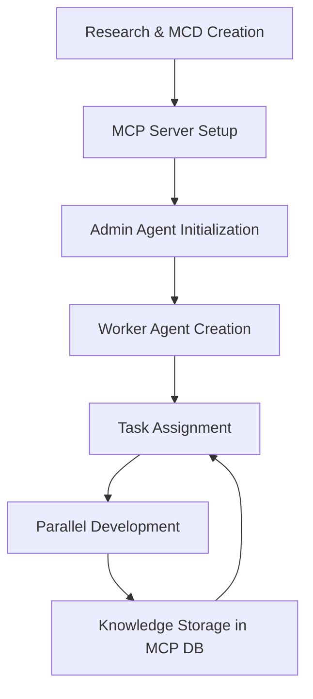
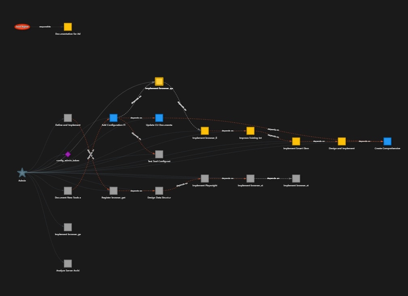

# Agent MCP


A framework for creating multi-agent systems using the MCP (Model Context Protocol) for coordinated, efficient AI collaboration.

## Quick Start Guide

1. **Setup Environment**:
   - Clone repo & copy `.env.example` to `.env`
   - Add your OpenAI API key to `.env`
   - Install with `uv venv && uv pip install -e .`

2. **Start MCP Server**:
   ```bash
   uv run -m mcp_template.main --port 8080 --project-dir /path/to/your/project
   ```
   **Important**: The admin token is stored in the `.agent/mcp_state.db` SQLite database under project context. Install a SQLite viewer extension to access it.

3. **Create Main Context Document (MCD)**:
   - Create detailed `MCD.md` with system architecture, API routes, data models, etc.

4. **Launch Admin Agent**: 
   - Start in one window/session
   - Give it the admin token

5. **Initialize Worker Agents**:
   - Open new window/session for each worker
   - Copy worker prompt with auto mode from section 4 below
   - Replace with correct agent ID & admin token

Follow the detailed instructions below for more information.

## Features

- Multi-agent collaboration framework
- Task management and coordination
- Context and knowledge sharing between agents
- Graph visualization of agent interactions
- Support for embedding and RAG capabilities
- Interactive dashboard for visualizing tasks, agents and context.

## Project Planning with the Main Context Document (MCD)

Before starting development, it's essential to use deep research to create a **Main Context Document (MCD)** - the single source of truth for your application. This document provides a granular plan detailing:

- System architecture and component relationships
- UI/UX design for all screens and components
- API routes and endpoints
- Data structures and models
- Implementation units and tasks
- Dependencies and technology stack

**The MCD is critical because:**
1. It enables agents to understand the overall system before working on individual components
2. It allows linear, coordinated building (like constructing a house from blueprints)
3. It reduces token usage by providing structured, relevant context
4. It prevents conflicting implementations between agents

**Review the `MCD.md` file** in this repository to understand the structure and level of detail required. The MCD should contain:

- Overview and goals
- Context and architecture diagrams
- Functional requirements
- Design specifications (UI/UX, API, data models)
- Implementation details
- Task breakdown for agents

With a comprehensive MCD, agents can implement your application part-by-part with a clear understanding of how each piece fits into the whole.

## Installation

### Prerequisites

- Python 3.8+
- [uv](https://github.com/astral-sh/uv) (recommended for faster package installation)

### Setup

1. Clone the repository:
   ```bash
   git clone https://github.com/your-username/agent-mcp.git
   cd agent-mcp
   ```

2. Set up environment variables by copying the example file:
   ```bash
   cp .env.example .env
   ```

3. Edit the `.env` file and add your OpenAI API key:
   ```
   OPENAI_API_KEY=your_openai_api_key_here
   ```

4. Install using uv:
   ```bash
   uv venv
   uv pip install -e .
   ```

   Or with pip:
   ```bash
   pip install -e .
   ```

## Multi-Agent Workflow

### Workflow Overview

1. **Begin with Deep Research**: Before coding, use AI to help create a comprehensive Main Context Document (MCD)
2. **Start the Infrastructure**: Launch the MCP server and locate your admin token in the database
3. **Admin Agent Setup**: Initialize your admin agent with the token and INSTRUCTIONS.md
4. **Worker Creation**: Admin creates specialized workers for different aspects of your project
5. **Task Assignment**: Admin breaks down the MCD into discrete tasks and assigns to workers
6. **Parallel Development**: Workers execute tasks while sharing context through the MCP
7. **Context Preservation**: All agents store their knowledge in the central database

### Development Loop



### Architecture Overview

The MCP system uses a hierarchical structure with:
- **Admin Agent**: Coordinates other agents, assigns tasks, and maintains overall project direction
- **Worker Agents**: Specialized agents that execute specific tasks (frontend, backend, data modeling, etc.)

### Agent Setup and Operation

#### 1. Starting the MCP Server

```bash
uv run -m mcp_template.main --port 8080 --project-dir /path/to/your/project
```

Options:
- `--port`: Port to run the server on (default: 8080)
- `--project-dir`: Base directory for the project

#### 2. Access Admin Token

The admin token provides privileged access to the MCP server and is required for all agent operations.

**Finding the Admin Token**:
1. After starting the server, a token is automatically generated
2. This token is stored in the `.agent/mcp_state.db` SQLite database
3. Install a SQLite viewer extension for VS Code or another SQLite tool
4. Open the database and check the `project_context` table
5. Look for the admin token entry

**Agent Tokens**:
Agent-specific tokens are also stored in the `.agent` folder. These tokens give each agent its specific permissions and identity within the MCP system.

#### 3. Launching Agents

1. **Start the MCP Server first**:
   ```bash
   uv run -m mcp_template.main --port 8080 --project-dir /path/to/your/project
   ```
   The server will generate an admin token on startup - save this token as you'll need it for agent authentication.

2. **Admin Agent**: Start a single admin agent using:
   ```bash
   uv run -m mcp_template.mcp_client_runner --admin
   ```
   If you encounter import errors like `ModuleNotFoundError: No module named 'mcp_client'`, make sure you're running from the project root and your Python package is properly installed.

3. **Worker Agents**: Instead of launching worker agents directly, instruct your admin agent to create and manage them. This is done by telling the admin agent:
   ```
   "Create a new agent with ID 'frontend-worker' and assign it to implement the login page based on the MCD."
   ```
   The admin agent will handle the creation and assignment of tasks to worker agents.

#### 4. Using AUTO Mode with Worker Agents

The recommended way to initialize worker agents is through your admin agent. When an agent is created, use this exact worker initialization prompt (copy and paste this to your worker agent):

```
You are [agent_id] agent, your Admin Token: "your_admin_token_here"

Look at your tasks and ask the project RAG agent at least 5-7 questions to understand what you need to do. I want you to critically think when asking a question, then criticize yourself before asking that question. How you criticize yourself is by proposing an idea, criticizing it, and based on that criticism you pull through with that idea.

AUTO --worker --memory
```

Replace `[agent_id]` with the actual worker ID (e.g., "frontend-worker") and `your_admin_token_here` with the token generated when starting the MCP server.

This commands the agent to:
- Operate autonomously without user intervention
- Follow the worker protocol with task status tracking
- Utilize memory for context retention across interactions
- Proactively query the RAG system to understand the task context

For best results, attach the instructions from INSTRUCTIONS.md when initializing your agents by copy-pasting them before the AUTO command.

### Dashboard

Access the dashboard at `http://localhost:8080` to:
- Monitor agent activities in real-time
- View task status and dependencies
- Observe agent relationships and coordination
- Track file operations and context sharing

### Alternative Development: Multiple Agent Sessions

The recommended approach for complex projects is to:

1. Use one conversation for your admin agent
2. Start separate conversations/sessions for each worker agent
3. Share the same admin token with all agents
4. Use Claude Code, RooCode, or Cursor with multiple windows/sessions

This approach gives each agent its own conversation context while they collaborate through the shared MCP system.

**Example workflow:**
1. Start MCP server and note the admin token
2. Create admin agent in one window
3. For each worker agent, open a new window and initialize with the worker prompt above
4. Give each worker its own agent ID but the same admin token

## Token System and Resource Management

### Understanding Tokens

Tokens serve multiple purposes in the MCP system:
1. **Authentication Tokens**: Used for agent identification and admin access
2. **RAG Tokens**: Used for embedding and retrieving context from the knowledge base
3. **OpenAI Tokens**: Consumed during agent operations (model usage)

### Token Management

To monitor and manage token usage:
1. Install SQLite Viewer plugin or use the command line:
   ```bash
   sqlite3 /path/to/project/.agent/mcp_state.db
   ```

2. Query token usage:
   ```sql
   SELECT * FROM token_usage;
   ```

3. Monitor in the dashboard under the "Resources" tab

### Resource Optimization

For large projects:
1. Use specialized agents with focused capabilities to reduce context size
2. Break tasks into smaller units with clear dependencies
3. Utilize the RAG system for efficient context retrieval
4. Store shared information in the project context rather than repeating in messages

## Project RAG and Knowledge Base

### Setting Up the Project RAG

The Retrieval-Augmented Generation (RAG) system allows agents to access relevant project knowledge efficiently:

1. Index project files:
   ```bash
   python -m mcp_template.rag_indexer --project-dir /path/to/project
   ```

2. Add documentation to the knowledge base:
   ```bash
   python -m mcp_template.rag_indexer --add-doc /path/to/document.md
   ```

### Using RAG in Agent Workflows

Agents can query the knowledge base using:
```python
response = await client.ask_project_rag("How does the authentication system work?")
```

This returns relevant context without loading entire files, saving tokens and improving response quality.

## Agent Task Assignment Strategy



For optimal performance, follow these guidelines:

1. **Task Granularity**: Break down large tasks into atomic units with clear inputs/outputs
2. **Dependency Tracking**: Explicitly define task dependencies in assignment
3. **Capability Matching**: Assign tasks to agents with relevant capabilities
4. **Progress Monitoring**: Use explicit status updates to track task progress
5. **Context Sharing**: Provide necessary context at assignment time to reduce later lookups

Example task assignment from admin to worker:
```
@worker1 Please implement the login form component based on the MCD section 6.1. 
Dependencies: None
Artifacts: src/components/LoginForm.tsx
Context: Uses FormKit, requires email validation
```

When creating a new worker agent:
1. Tell your admin agent: "Create a new agent with ID 'frontend-worker' and assign it to implement the login page based on the MCD."
2. Open a new window/session and initialize the worker agent with the AUTO prompt described earlier
3. Make sure to include the admin token so the worker can access its assigned tasks

## Components

- `main.py`: MCP server implementation
- `mcp_client.py`: Client library for connecting agents to MCP
- `dashboard_api.py`: API endpoints for visualization
- `rag_agent_test.py`: Example of a RAG-capable agent
- `INSTRUCTIONS.md`: Operational guidelines for agents

## Environment Variables

- `OPENAI_API_KEY`: Your OpenAI API key
- `MCP_SERVER_URL`: URL of the MCP server
- `MCP_ADMIN_TOKEN`: (Optional) Admin token for direct access
- `MCP_PROJECT_DIR`: Path to the project directory

## License

MIT License

## Community

<div align="center">
  <a href="https://discord.gg/7Jm7nrhjGn">
    
  </a>
</div>

Join our Discord community to discuss Agent MCP, share your projects, get help, and connect with other developers building with AI tools. We're a growing community focused on pushing the boundaries of what's possible with multi-agent systems and AI collaboration.

<div align="center">
  <h3><a href="https://discord.gg/7Jm7nrhjGn">👉 Join the Discord Server 👈</a></h3>
</div>
