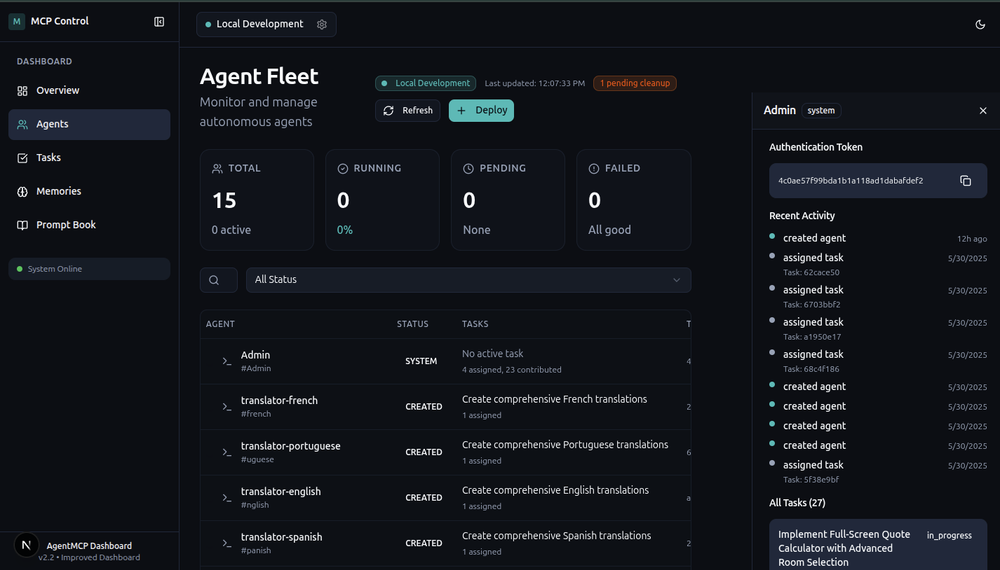
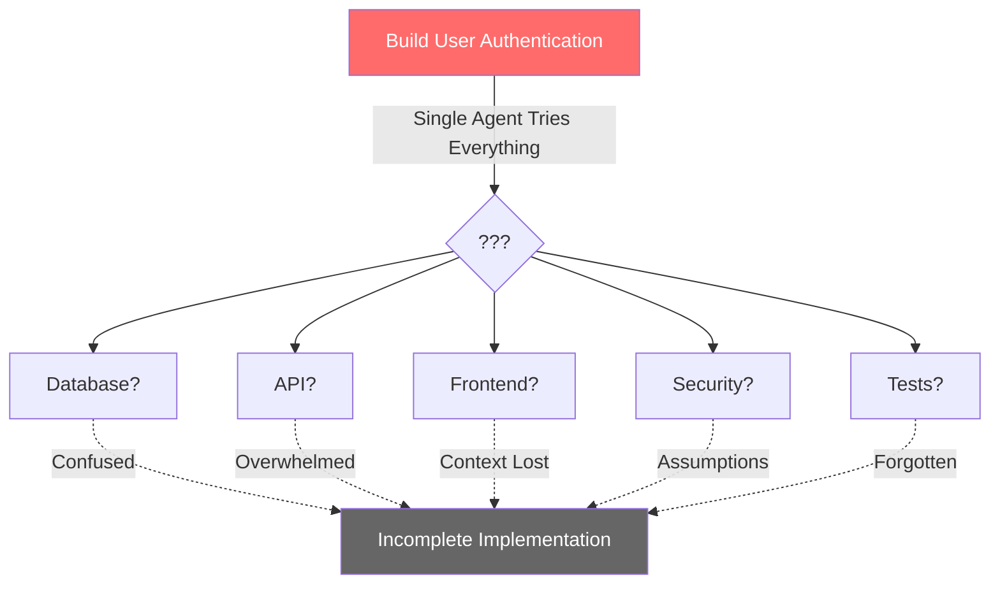
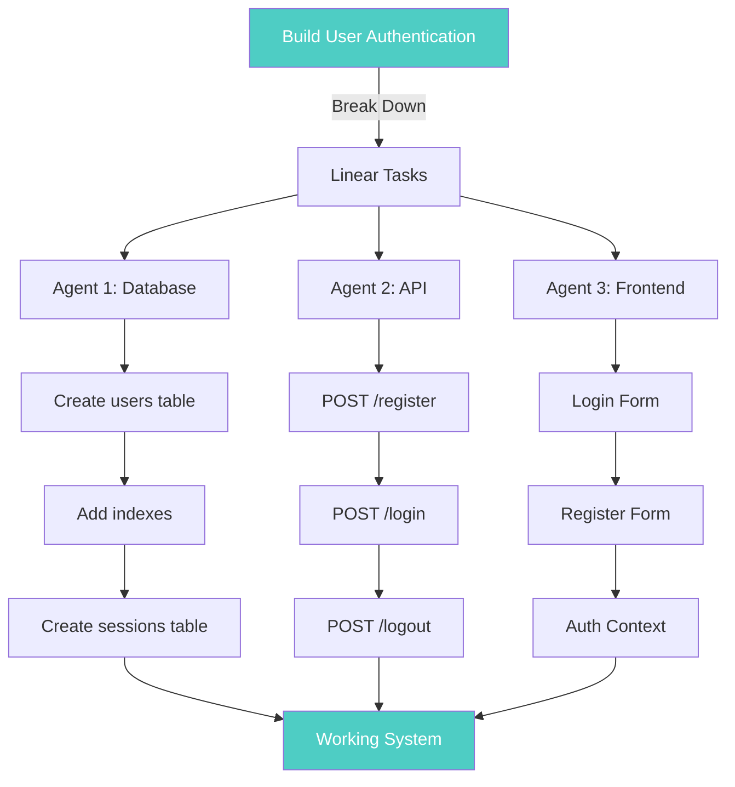

# Agent-MCP

[](https://deepwiki.com/rinadelph/Agent-MCP)

> 🚀 **Advanced Tool Notice**: This framework is designed for experienced AI developers who need sophisticated multi-agent orchestration capabilities. Agent-MCP requires familiarity with AI coding workflows, MCP protocols, and distributed systems concepts. We're actively working to improve documentation and ease of use. If you're new to AI-assisted development, consider starting with simpler tools and returning when you need advanced multi-agent capabilities.
>
> 📅 **Weekend Workshop**: Join our hands-on Agent-MCP workshop this weekend! Connect with us on [Discord](https://discord.gg/7Jm7nrhjGn) to participate and learn directly from the maintainers how to implement multi-agent development workflows.

Multi-Agent Collaboration Protocol for coordinated AI software development.

<div align="center">
  
</div>

Think **Obsidian for your AI agents** - a living knowledge graph where multiple AI agents collaborate through shared context, intelligent task management, and real-time visualization. Watch your codebase evolve as specialized agents work in parallel, never losing context or stepping on each other's work.

## Why Multiple Agents?

Beyond the philosophical issues, traditional AI coding assistants hit practical limitations:
- **Context windows overflow** on large codebases
- **Knowledge gets lost** between conversations
- **Single-threaded execution** creates bottlenecks
- **No specialization** - one agent tries to do everything
- **Constant rework** from lost context and confusion

## The Multi-Agent Solution

Agent-MCP transforms AI development from a single assistant to a coordinated team:

<div align="center">
  
</div>

**Real-time visualization** shows your AI team at work - purple nodes represent context entries, blue nodes are agents, and connections show active collaborations. It's like having a mission control center for your development team.

### Core Capabilities

**Parallel Execution**  
Multiple specialized agents work simultaneously on different parts of your codebase. Backend agents handle APIs while frontend agents build UI components, all coordinated through shared memory.

**Persistent Knowledge Graph**  

<div align="center">
  
</div>

Your project's entire context lives in a searchable, persistent memory bank. Agents query this shared knowledge to understand requirements, architectural decisions, and implementation details. Nothing gets lost between sessions.

**Intelligent Task Management**  

<div align="center">
  
</div>

Monitor every agent's status, assigned tasks, and recent activity. The system automatically manages task dependencies, prevents conflicts, and ensures work flows smoothly from planning to implementation.

## Quick Start

```bash
# Clone and setup
git clone https://github.com/rinadelph/Agent-MCP.git
cd Agent-MCP

# Check version requirements
python --version  # Should be >=3.10
node --version    # Should be >=18.0.0
npm --version     # Should be >=9.0.0

# If using nvm for Node.js version management
nvm use  # Uses the version specified in .nvmrc

# Configure environment
cp .env.example .env  # Add your OpenAI API key
uv venv && uv pip install -e .

# Start the server
uv run -m agent_mcp.cli --project-dir /path/to/your/project

# Launch dashboard (recommended for full experience)
cd agent_mcp/dashboard && npm install && npm run dev
```


## How It Works: Breaking Complexity into Simple Steps


Every task can be broken down into linear steps. This is the core insight that makes Agent-MCP powerful.

### The Problem with Complex Tasks



### The Agent-MCP Solution



Each agent focuses on their linear chain. No confusion. No context pollution. Just clear, deterministic progress.

## The 5-Step Workflow

### 1. Initialize Admin Agent
```
You are the admin agent.
Admin Token: "your_admin_token_from_server"

Your role is to:
- Coordinate all development work
- Create and manage worker agents
- Maintain project context
- Assign tasks based on agent specializations
```

### 2. Load Your Project Blueprint (MCD)
```
Add this MCD (Main Context Document) to project context:

[paste your MCD here - see docs/mcd-guide.md for structure]

Store every detail in the knowledge graph. This becomes the single source of truth for all agents.
```

The MCD (Main Context Document) is your project's comprehensive blueprint - think of it as writing the book of your application before building it. It includes:
- Technical architecture and design decisions
- Database schemas and API specifications
- UI component hierarchies and workflows
- Task breakdowns with clear dependencies

See our [MCD Guide](./docs/mcd-guide.md) for detailed examples and templates.

### 3. Deploy Your Agent Team
```
Create specialized agents for parallel development:

- backend-worker: API endpoints, database operations, business logic
- frontend-worker: UI components, state management, user interactions
- integration-worker: API connections, data flow, system integration
- test-worker: Unit tests, integration tests, validation
- devops-worker: Deployment, CI/CD, infrastructure
```

Each agent specializes in their domain, leading to higher quality implementations and faster development.

### 4. Initialize and Deploy Workers
```
# In new window for each worker:
You are [worker-name] agent.
Your Admin Token: "worker_token_from_admin"

Query the project knowledge graph to understand:
1. Overall system architecture
2. Your specific responsibilities
3. Integration points with other components
4. Coding standards and patterns to follow
5. Current implementation status

Begin implementation following the established patterns.

AUTO --worker --memory
```

**Important: Setting Agent Modes**

Agent modes (like `--worker`, `--memory`, `--playwright`) are not just flags - they activate specific behavioral patterns. In Claude Code, you can make these persistent by:

1. Copy the mode instructions to your clipboard
2. Type `#` to open Claude's memory feature
3. Paste the instructions for persistent behavior

Example for Claude Code memory:
```
# When I use "AUTO --worker --memory", follow these patterns:
- Always check file status before editing
- Query project RAG for context before implementing
- Document all changes in task notes
- Work on one file at a time, completing it before moving on
- Update task status after each completion
```

This ensures consistent behavior across your entire session without repeating instructions.

### 5. Monitor and Coordinate

The dashboard provides real-time visibility into your AI development team:

**Network Visualization** - Watch agents collaborate and share information  
**Task Progress** - Track completion across all parallel work streams  
**Memory Health** - Ensure context remains fresh and accessible  
**Activity Timeline** - See exactly what each agent is doing

Access at `http://localhost:3847` after launching the dashboard.

## Advanced Features

### Specialized Agent Modes

Agent modes fundamentally change how agents behave. They're not just configuration - they're behavioral contracts that ensure agents follow specific patterns optimized for their role.

**Standard Worker Mode**
```
AUTO --worker --memory
```
Optimized for implementation tasks:
- Granular file status checking before any edits
- Sequential task completion (one at a time)
- Automatic documentation of changes
- Integration with project RAG for context
- Task status updates after each completion

**Frontend Specialist Mode**
```
AUTO --worker --playwright
```
Enhanced with visual validation capabilities:
- All standard worker features
- Browser automation for component testing
- Screenshot capabilities for visual regression
- DOM interaction for end-to-end testing
- Component-by-component implementation with visual verification

**Research Mode**
```
AUTO --memory
```
Read-only access for analysis and planning:
- No file modifications allowed
- Deep context exploration via RAG
- Pattern identification across codebase
- Documentation generation
- Architecture analysis and recommendations

**Memory Management Mode**
```
AUTO --memory --manager
```
For context curation and optimization:
- Memory health monitoring
- Stale context identification
- Knowledge graph optimization
- Context summarization for new agents
- Cross-agent knowledge transfer

Each mode enforces specific behaviors that prevent common mistakes and ensure consistent, high-quality output.

### Project Memory Management

The system maintains several types of memory:

**Project Context** - Architectural decisions, design patterns, conventions  
**Task Memory** - Current status, blockers, implementation notes  
**Agent Memory** - Individual agent learnings and specializations  
**Integration Points** - How different components connect

All memory is:
- Searchable via semantic queries
- Version controlled for rollback
- Tagged for easy categorization
- Automatically garbage collected when stale

### Conflict Resolution

File-level locking prevents agents from overwriting each other's work:

1. Agent requests file access
2. System checks if file is locked
3. If locked, agent works on other tasks or waits
4. After completion, lock is released
5. Other agents can now modify the file

This happens automatically - no manual coordination needed.

## Short-Lived vs. Long-Lived Agents: The Critical Difference

### Traditional Long-Lived Agents
Most AI coding assistants maintain conversations across entire projects:
- **Accumulated context grows unbounded** - mixing unrelated code, decisions, and conversations
- **Confused priorities** - yesterday's bug fix mingles with today's feature request
- **Hallucination risks increase** - agents invent connections between unrelated parts
- **Performance degrades over time** - every response processes irrelevant history
- **Security vulnerability** - one carefully crafted prompt could expose your entire project

### Agent-MCP's Ephemeral Agents
Each agent is purpose-built for a single task:
- **Minimal, focused context** - only what's needed for the specific task
- **Crystal clear objectives** - one task, one goal, no ambiguity
- **Deterministic behavior** - limited context means predictable outputs
- **Consistently fast responses** - no context bloat to slow things down
- **Secure by design** - agents literally cannot access what they don't need

### A Practical Example

**Traditional Approach**: "Update the user authentication system"
```
Agent: I'll update your auth system. I see from our previous conversation about 
database migrations, UI components, API endpoints, deployment scripts, and that 
bug in the payment system... wait, which auth approach did we decide on? Let me 
try to piece this together from our 50+ message history...

[Agent produces confused implementation mixing multiple patterns]
```

**Agent-MCP Approach**: Same request, broken into focused tasks
```
Agent 1 (Database): Create auth tables with exactly these fields...
Agent 2 (API): Implement /auth endpoints following REST patterns...
Agent 3 (Frontend): Build login forms using existing component library...
Agent 4 (Tests): Write auth tests covering these specific scenarios...
Agent 5 (Integration): Connect components following documented interfaces...

[Each agent completes their specific task without confusion]
```

## The Theory Behind Linear Decomposition

### The Philosophy: Short-Lived Agents, Granular Tasks

Most AI development approaches suffer from a fundamental flaw: they try to maintain massive context windows with a single, long-running agent. This leads to:

- **Context pollution** - Irrelevant information drowns out what matters
- **Hallucination risks** - Agents invent connections between unrelated parts
- **Security vulnerabilities** - Agents with full context can be manipulated
- **Performance degradation** - Large contexts slow down reasoning
- **Unpredictable behavior** - Too much context creates chaos

### Our Solution: Ephemeral Agents with Shared Memory

Agent-MCP implements a radically different approach:

**Short-Lived, Focused Agents**  
Each agent lives only as long as their specific task. They:
- Start with minimal context (just what they need)
- Execute granular, linear tasks with clear boundaries
- Document their work in shared memory
- Terminate upon completion

**Shared Knowledge Graph (RAG)**  
Instead of cramming everything into context windows:
- Persistent memory stores all project knowledge
- Agents query only what's relevant to their task
- Knowledge accumulates without overwhelming any single agent
- Clear separation between working memory and reference material

**Result**: Agents that are fast, focused, and safe. They can't be manipulated to reveal full project details because they never have access to it all at once.

### Why This Matters for Safety

Traditional long-context agents are like giving someone your entire codebase, documentation, and secrets in one conversation. Our approach is like having specialized contractors who only see the blueprint for their specific room.

- **Reduced attack surface** - Agents can't leak what they don't know
- **Deterministic behavior** - Limited context means predictable outputs
- **Audit trails** - Every agent action is logged and traceable
- **Rollback capability** - Mistakes are isolated to specific tasks

### The Cleanup Protocol: Keeping Your System Lean

Agent-MCP enforces strict lifecycle management:

**Maximum 10 Active Agents**
- Hard limit prevents resource exhaustion
- Forces thoughtful task allocation
- Maintains system performance

**Automatic Cleanup Rules**
- Agent finishes task → Immediately terminated
- Agent idle 60+ seconds → Killed and task reassigned
- Need more than 10 agents → Least productive agents removed

**Why This Matters**
- **No zombie processes** eating resources
- **Fresh context** for every task
- **Predictable resource usage**
- **Clean system state** always

This isn't just housekeeping - it's fundamental to the security and performance benefits of the short-lived agent model.

### The Fundamental Principle

**Any task that cannot be expressed as `Step 1 → Step 2 → Step N` is not atomic enough.**

This principle drives everything in Agent-MCP:

1. **Complex goals** must decompose into **linear sequences**
2. **Linear sequences** can execute **in parallel** when independent
3. **Each step** must have **clear prerequisites** and **deterministic outputs**
4. **Integration points** are **explicit** and **well-defined**

### Why Linear Decomposition Works

**Traditional Approach**: "Build a user authentication system"
- Vague requirements lead to varied implementations
- Agents make different assumptions
- Integration becomes a nightmare

**Agent-MCP Approach**: 
```
Chain 1: Database Layer
  1.1: Create users table with id, email, password_hash
  1.2: Add unique index on email
  1.3: Create sessions table with user_id, token, expiry
  1.4: Write migration scripts
  
Chain 2: API Layer  
  2.1: Implement POST /auth/register endpoint
  2.2: Implement POST /auth/login endpoint
  2.3: Implement POST /auth/logout endpoint
  2.4: Add JWT token generation
  
Chain 3: Frontend Layer
  3.1: Create AuthContext provider
  3.2: Build LoginForm component
  3.3: Build RegisterForm component
  3.4: Implement protected routes
```

Each step is atomic, testable, and has zero ambiguity. Multiple agents can work these chains in parallel without conflict.

## Why Developers Choose Agent-MCP

**The Power of Parallel Development**  
Instead of waiting for one agent to finish the backend before starting the frontend, deploy specialized agents to work simultaneously. Your development speed is limited only by how well you decompose tasks.

**No More Lost Context**  
Every decision, implementation detail, and architectural choice is stored in the shared knowledge graph. New agents instantly understand the project state without reading through lengthy conversation histories.

**Predictable, Reliable Outputs**  
Focused agents with limited context produce consistent results. The same task produces the same quality output every time, making development predictable and testable.

**Built-in Conflict Prevention**  
File-level locking and task assignment prevent agents from stepping on each other's work. No more merge conflicts from simultaneous edits.

**Complete Development Transparency**  
Watch your AI team work in real-time through the dashboard. Every action is logged, every decision traceable. It's like having a live view into your development pipeline.

**For Different Team Sizes**

**Solo Developers**: Transform one AI assistant into a coordinated team. Work on multiple features simultaneously without losing track.

**Small Teams**: Augment human developers with AI specialists that maintain perfect context across sessions.

**Large Projects**: Handle complex systems where no single agent could hold all the context. The shared memory scales infinitely.

**Learning & Teaching**: Perfect for understanding software architecture. Watch how tasks decompose and integrate in real-time.

## System Requirements

- **Python**: 3.10+ with pip or uv
- **Node.js**: 18.0.0+ (recommended: 22.16.0)
- **npm**: 9.0.0+ (recommended: 10.9.2)
- **OpenAI API key** (for embeddings and RAG)
- **RAM**: 4GB minimum
- **AI coding assistant**: Claude Code or Cursor

For consistent development environment:
```bash
# Using nvm (Node Version Manager)
nvm use  # Automatically uses Node v22.16.0 from .nvmrc

# Or manually check versions
node --version  # Should be >=18.0.0
npm --version   # Should be >=9.0.0
python --version  # Should be >=3.10
```

## Troubleshooting

**"Admin token not found"**  
Check the server startup logs - token is displayed when MCP server starts.

**"Worker can't access tasks"**  
Ensure you're using the worker token (not admin token) when initializing workers.

**"Agents overwriting each other"**  
Verify all workers are initialized with the `--worker` flag for proper coordination.

**"Dashboard connection failed"**  
1. Ensure MCP server is running first
2. Check Node.js version (18+ required)
3. Reinstall dashboard dependencies

**"Memory queries returning stale data"**  
Run memory garbage collection through the dashboard or restart with `--refresh-memory`.

## Documentation

- [Getting Started Guide](./docs/getting-started.md) - Complete walkthrough with examples
- [MCD Creation Guide](./docs/mcd-guide.md) - Write effective project blueprints
- [Theoretical Foundation](./docs/chapter-1-cognitive-empathy.md) - Understanding AI cognition
- [Architecture Overview](./docs/architecture.md) - System design and components
- [API Reference](./docs/api-reference.md) - Complete technical documentation

## Community and Support

**Get Help**
- [Discord Community](https://discord.gg/7Jm7nrhjGn) - Active developer discussions
- [GitHub Issues](https://github.com/rinadelph/Agent-MCP/issues) - Bug reports and features
- [Discussions](https://github.com/rinadelph/Agent-MCP/discussions) - Share your experiences

**Contributing**
We welcome contributions! See our [Contributing Guide](CONTRIBUTING.md) for:
- Code style and standards
- Testing requirements
- Pull request process
- Development setup

## License

MIT License - see [LICENSE](LICENSE) for details.

---

Built by developers who believe AI collaboration should be as sophisticated as human collaboration.