# RAG System Architecture & Concepts Explained

## Table of Contents
1. [Overview](#overview)
2. [Core Concepts](#core-concepts)
3. [System Architecture](#system-architecture)
4. [Data Flow](#data-flow)
5. [Database Schema](#database-schema)
6. [Practical Examples](#practical-examples)
7. [Configuration](#configuration)

## Overview

The RAG (Retrieval Augmented Generation) system in Agent-MCP enables agents to access and utilize project-specific knowledge, ensuring they work with accurate, up-to-date information about your codebase rather than relying solely on their training data.

## Core Concepts

### 🗂️ Knowledge Base
The complete repository of information about your project. It's the sum of all indexed and stored data that agents can query.

**Components:**
- Indexed source code files
- Documentation (markdown files)
- Project context (agent-stored key-value pairs)
- Task definitions and history
- Agent actions and decisions

**Analogy:** Think of it as a company's internal wiki + code repository + project management system all searchable in one place.

### 📚 RAG (Retrieval Augmented Generation)

RAG is a three-step process that enhances AI responses with relevant context:

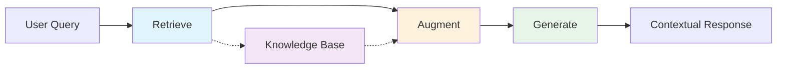

**Step by Step:**
1. **Retrieve:** Find relevant information from the knowledge base
2. **Augment:** Add retrieved context to the AI's prompt
3. **Generate:** Produce response using both AI training and retrieved context

**Example:**
```
Query: "How does user authentication work in this project?"
↓
Retrieve: Finds auth.ts, login components, API endpoints
↓
Augment: Adds code snippets and docs to prompt
↓
Generate: "Based on the codebase, authentication uses JWT tokens with a 24-hour expiry, stored in httpOnly cookies. The login endpoint is at /api/auth/login..."
```

### 🔄 Indexing

The process of scanning, processing, and storing project files for searchability.

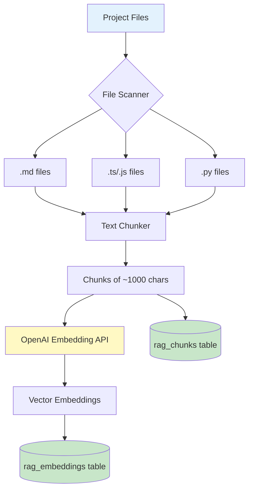

**Process Details:**
1. **Scanning:** Finds all relevant files (skips node_modules, .git, etc.)
2. **Chunking:** Breaks files into ~1000 character pieces with overlap
3. **Embedding:** Converts each chunk to a vector using OpenAI
4. **Storing:** Saves chunks and embeddings in database
5. **Updating:** Re-indexes changed files based on hash comparison

### 🧮 Embeddings

Numerical representations of text that capture semantic meaning.

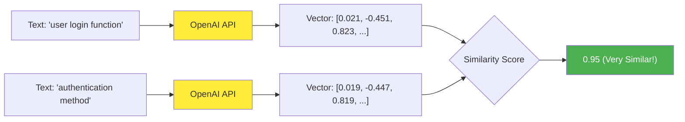

**Key Properties:**
- **Dimension:** 1536 numbers per embedding (using text-embedding-3-large)
- **Similarity:** Closer vectors = more similar meaning
- **Language Agnostic:** "login user" ≈ "utilisateur connexion" ≈ "ユーザーログイン"
- **Semantic Search:** Finds meaning, not just keyword matches

### 📝 Project Context

Structured data that agents explicitly store for coordination and memory.

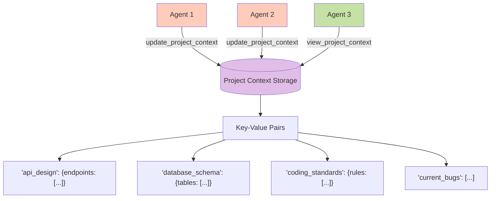

**Characteristics:**
- **Structured:** JSON-formatted data
- **Persistent:** Survives agent restarts
- **Shared:** All agents can read/write
- **Versioned:** Tracks last update time
- **Searchable:** Part of RAG queries

## System Architecture

### Complete System Flow

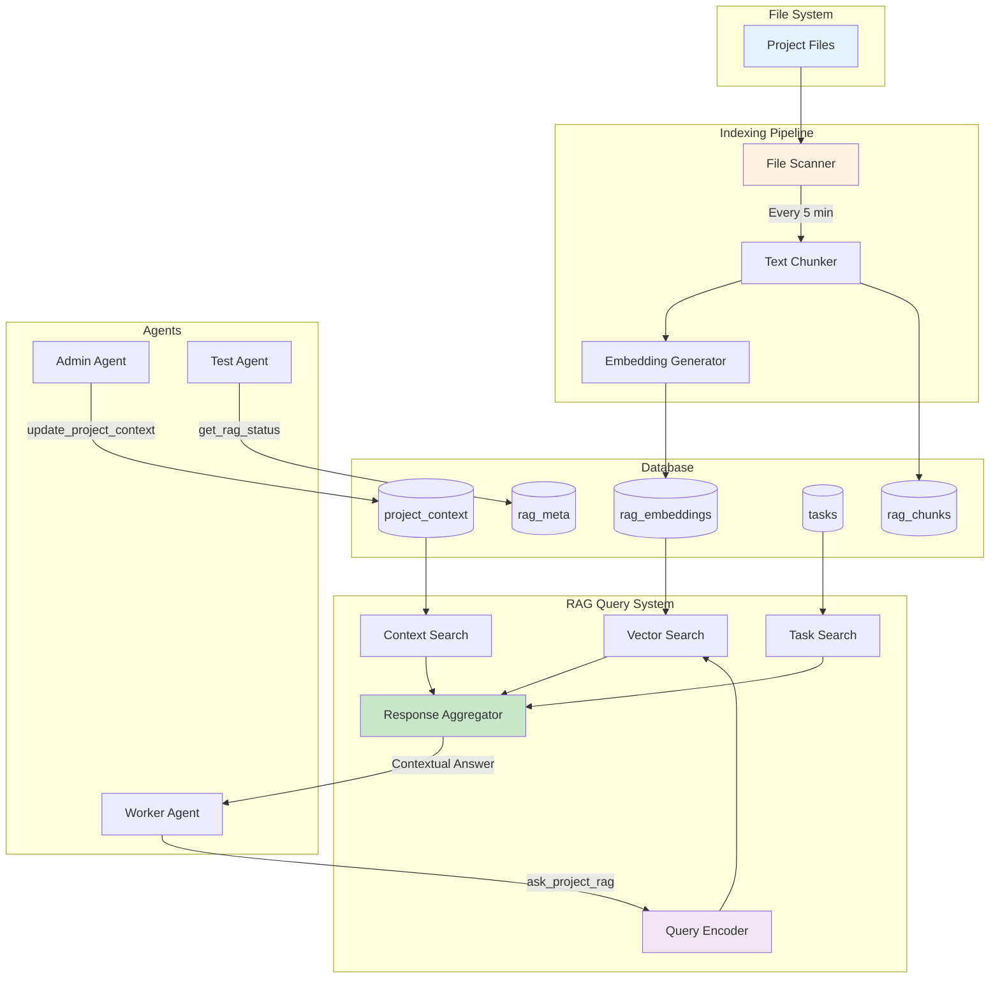

## Data Flow

### 1. Initial Indexing (First Run)

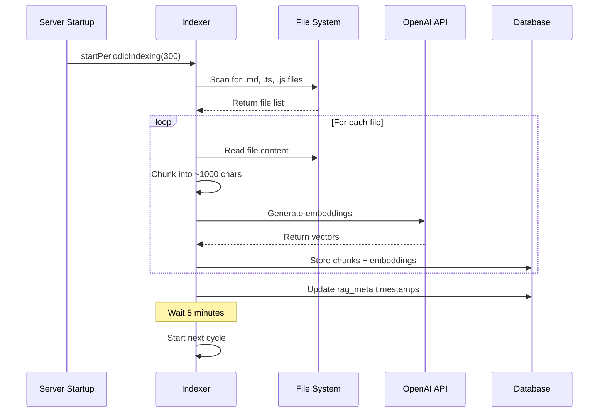

### 2. Agent RAG Query

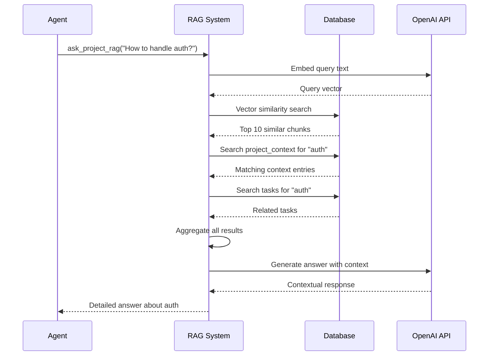

### 3. Context Update Flow

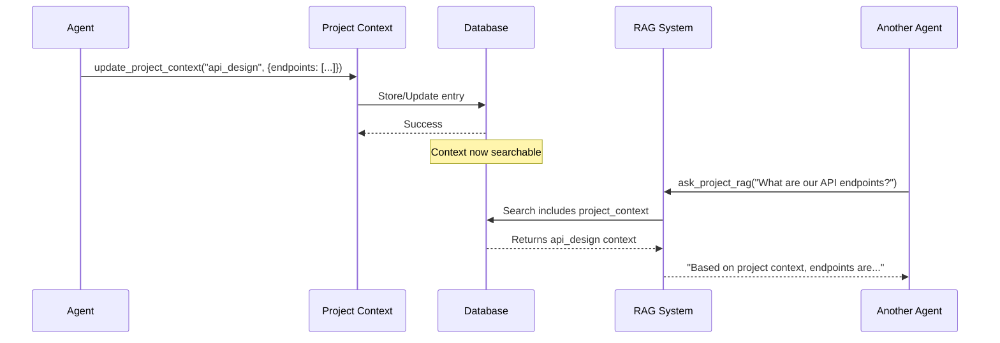

## Database Schema

### Core Tables

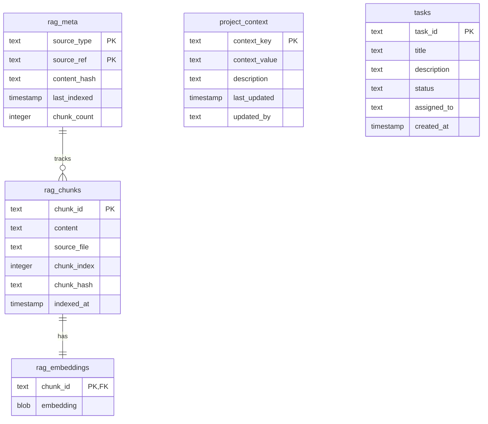

### Table Purposes

| Table | Purpose | Key Fields |
|-------|---------|------------|
| **rag_chunks** | Stores text fragments from indexed files | content, source_file, chunk_hash |
| **rag_embeddings** | Stores vector embeddings for similarity search | chunk_id, embedding (1536-dim vector) |
| **rag_meta** | Tracks indexing metadata and file hashes | source_ref, content_hash, last_indexed |
| **project_context** | Agent-stored key-value information | context_key, context_value, updated_by |
| **tasks** | Task definitions and assignments | task_id, description, assigned_to |

## Practical Examples

### Example 1: Code Pattern Discovery

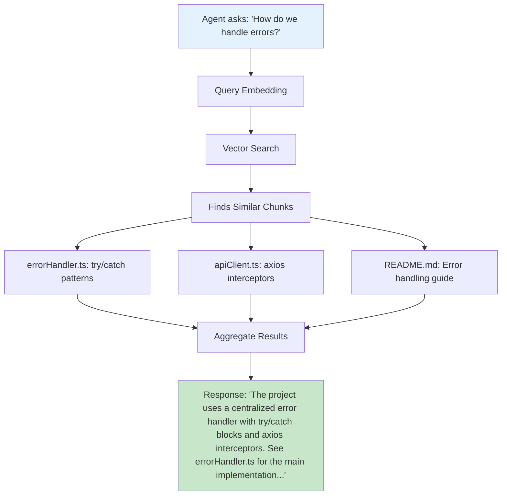

### Example 2: Project Context Usage

```typescript
// Agent 1 discovers API design
await update_project_context({
  context_key: "api_versioning",
  context_value: JSON.stringify({
    strategy: "URL path versioning",
    current: "v2",
    deprecated: ["v1"],
    pattern: "/api/v{version}/{resource}"
  }),
  description: "API versioning strategy decided after team discussion"
});

// Agent 2 queries about API design
const answer = await ask_project_rag("How should I version the new endpoint?");
// Returns: "Based on project context, use URL path versioning with pattern /api/v2/..."
```

### Example 3: Multi-Source RAG Response

When an agent asks: **"What is the user authentication flow?"**

The RAG system searches:

1. **Code files** (rag_chunks/embeddings):
   ```typescript
   // From auth.service.ts
   async login(email: string, password: string) {
     const user = await validateCredentials(email, password);
     const token = generateJWT(user);
     return { token, expiresIn: '24h' };
   }
   ```

2. **Documentation** (rag_chunks/embeddings):
   ```markdown
   # Authentication Flow
   1. User submits credentials to /api/auth/login
   2. Server validates against database
   3. JWT token generated with 24h expiry
   ```

3. **Project Context** (project_context):
   ```json
   {
     "auth_method": "JWT with httpOnly cookies",
     "token_expiry": "24 hours",
     "refresh_strategy": "Silent refresh every 20 hours"
   }
   ```

4. **Related Tasks** (tasks):
   ```
   Task #AUTH-001: "Implement 2FA for admin users"
   Status: In Progress
   Assigned: agent-frontend-01
   ```

The response combines all sources:
> "The authentication flow uses JWT tokens with 24-hour expiry stored in httpOnly cookies. Users login via `/api/auth/login` endpoint, credentials are validated against the database, and a JWT is returned. There's an ongoing task (AUTH-001) to add 2FA for admin users. The system uses silent refresh every 20 hours to maintain sessions."

## Configuration

### Environment Variables

| Variable | Purpose | Default |
|----------|---------|---------|
| `DISABLE_AUTO_INDEXING` | Disable automatic indexing | `false` |
| `OPENAI_API_KEY` | API key for embeddings | Required |
| `EMBEDDING_PROVIDER` | Which embedding service | `openai` |
| `MCP_DEBUG` | Show detailed RAG operations | `false` |

### Indexing Configuration

```typescript
// src/features/rag/indexing.ts
const IGNORE_DIRS = [
  'node_modules', '.git', 'dist', 'build', '.agent'
];

const MARKDOWN_EXTENSIONS = ['.md', '.markdown', '.txt'];

const CODE_EXTENSIONS = [
  '.ts', '.tsx', '.js', '.jsx', '.py', '.java', '.go', '.rs'
];

// Indexing runs every 5 minutes by default
startPeriodicIndexing(300); // seconds
```

### Chunk Configuration

```typescript
// src/features/rag/chunking.ts
const CHUNK_SIZE = 1000;        // Target chunk size in characters
const CHUNK_OVERLAP = 200;      // Overlap between chunks
const MIN_CHUNK_SIZE = 100;     // Minimum viable chunk
```

## Performance Considerations

### Vector Search Performance

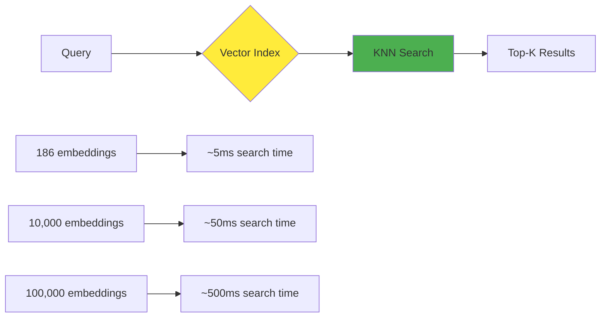

### Indexing Performance

| File Count | Index Time | Embedding Cost | Storage |
|------------|------------|----------------|---------|
| 10 files | ~30 seconds | ~$0.001 | ~100KB |
| 100 files | ~5 minutes | ~$0.01 | ~1MB |
| 1000 files | ~45 minutes | ~$0.10 | ~10MB |

### Query Performance

| Operation | Typical Time | Scaling Factor |
|-----------|--------------|----------------|
| Embed query | 200-500ms | Constant |
| Vector search | 5-50ms | Linear with DB size |
| Context retrieval | 10-20ms | Linear with matches |
| Response generation | 1-3s | Depends on context size |

## Troubleshooting

### Common Issues

1. **"No content indexed"**
   - Check if indexing is running: Look for "RAG indexing started" in logs
   - Verify OpenAI API key is set
   - Ensure sqlite-vec extension loaded

2. **"Vector search not available"**
   - sqlite-vec extension not installed
   - Database not initialized properly
   - Check server startup logs

3. **"Stale information returned"**
   - Indexing interval too long (default 5 min)
   - File changes not detected (check hash comparison)
   - Manual trigger: Restart server to force reindex

4. **"Context not found"**
   - Project context not set by agents
   - Key name mismatch
   - Context was deleted or expired

## Best Practices

### For Agents

1. **Always check RAG status first:**
   ```typescript
   const status = await get_rag_status();
   if (status.chunkCount === 0) {
     // Request indexing or wait
   }
   ```

2. **Use specific queries:**
   - ❌ "How does this work?"
   - ✅ "How does the user authentication JWT validation work?"

3. **Store important discoveries:**
   ```typescript
   await update_project_context({
     context_key: "discovered_pattern_auth",
     context_value: JSON.stringify({...}),
     description: "Authentication pattern found in codebase"
   });
   ```

### For System Administrators

1. **Optimize indexing frequency:**
   - Active development: 5 minutes
   - Stable projects: 30 minutes
   - Large codebases: 60 minutes

2. **Monitor embedding costs:**
   - Each file ~$0.0001
   - Consider excluding test files
   - Use `.agentignore` for exclusions

3. **Database maintenance:**
   - Periodic cleanup of old chunks
   - Vacuum database monthly
   - Monitor embedding table size

## Summary

The RAG system transforms Agent-MCP from generic AI assistants into project-aware developers. By combining:
- **Indexed code** (what exists)
- **Project context** (what was decided)  
- **Tasks** (what needs doing)
- **Vector search** (semantic understanding)

Agents can answer questions like "How should I implement this feature?" with accurate, project-specific guidance rather than generic programming advice.

The system continuously learns and updates, ensuring agents always work with current information about your evolving codebase.